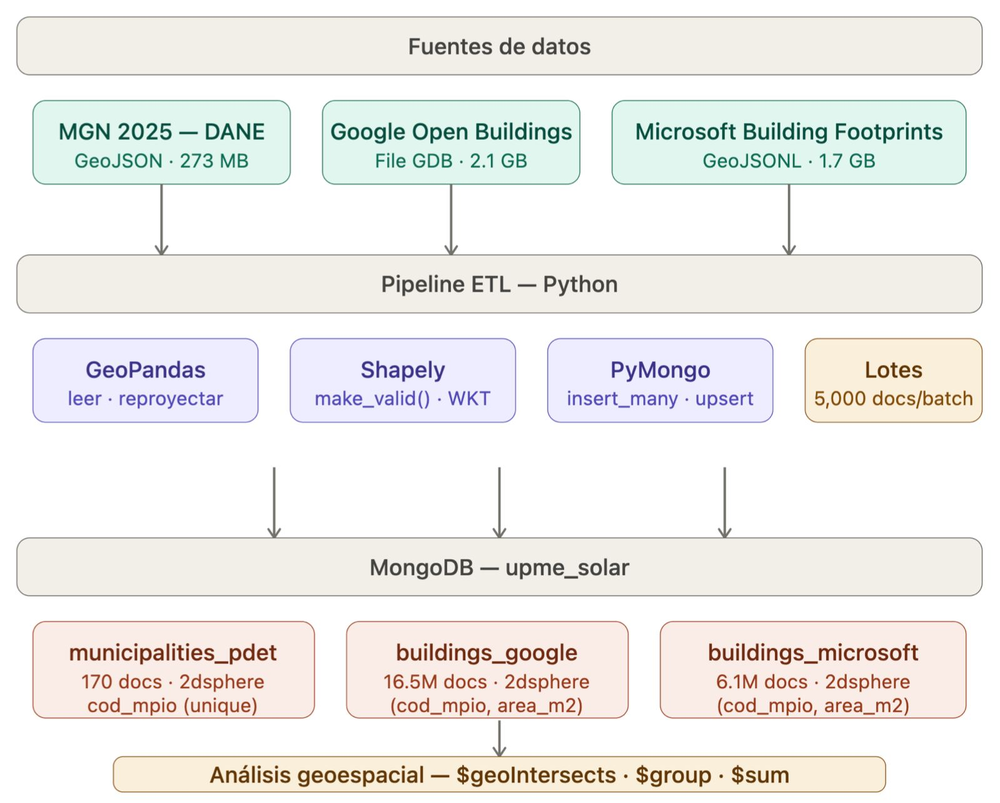

# Implementation Plan — UPME Solar Energy Feasibility Analysis

## 1. Objetivo

Diseñar e implementar una solución NoSQL escalable para almacenar, consultar y analizar datos geoespaciales de edificaciones en los 170 municipios PDET de Colombia, con el fin de estimar el potencial de energía solar a partir del área de techos disponibles.

## 2. Motor NoSQL Seleccionado: MongoDB

### Justificación

**MongoDB** fue seleccionado por su soporte nativo de GeoJSON, operadores espaciales integrados (`$geoIntersects`, `$geoWithin`, `$geoNear`), índices `2dsphere` para geometría esférica, y la madurez de su ecosistema Python con PyMongo.

## 3. Arquitectura del Sistema

```
┌──────────────────────────────────────────────────────────────┐
│                   Fuentes de Datos                           │
│  MGN/DANE (.geojson)  │  Google OB (.gdb)  │  MS (.geojsonl) │
└──────────┬────────────┴────────┬───────────┴────────┬────────┘
           │                    │                     │
           ▼                    ▼                     ▼
┌─────────────────────────────────────────────────────┐
│              ETL Pipeline (Python)                  │
│  GeoPandas · Shapely · PyMongo · make_valid()       │
└──────────────────────┬──────────────────────────────┘
                       │
                       ▼
┌─────────────────────────────────────────────────────┐
│           MongoDB — Base de datos: upme_solar       │
│                                                     │
│  municipalities_pdet    buildings_google            │
│  buildings_microsoft                                │
│                                                     │
│  Índices: 2dsphere (geometría) + compuestos         │
└─────────────────────────────────────────────────────┘
                       │
                       ▼
┌──────────────────────────────────────────────────────┐
│         Análisis Geoespacial (Jupyter)               │
│  $geoIntersects · $group · $sum · Folium · Matplotlib│
└──────────────────────────────────────────────────────┘
```
## 3. Diagrama de Arquitectura



El flujo completo va de las tres fuentes de datos (MGN/DANE, Google Open Buildings, Microsoft Building Footprints) a través del pipeline ETL en Python (GeoPandas, Shapely, PyMongo) hacia las tres colecciones en MongoDB, con índices `2dsphere` que habilitan el análisis geoespacial de la Entrega 4.

## 4. Stack Tecnológico

| Componente | Tecnología | Versión | Uso |
|---|---|---|---|
| Base de datos | MongoDB Community | 8.2.7 | Motor NoSQL principal |
| Driver Python | PyMongo | 4.17.0 | Conexión y operaciones |
| Datos geoespaciales | GeoPandas | 1.1.3 | Lectura y transformación de geometrías |
| Geometría | Shapely | 2.1.2 | Validación y reparación de polígonos |
| Lectura de archivos | PyOGRIO | 0.12.1 | Lectura de File Geodatabase (.gdb) |
| Proyecciones | PyProj | 3.7.2 | Conversión entre sistemas de coordenadas |
| Tablas | Pandas | 2.2.3 | Manipulación de datos tabulares |
| Visualización | Folium + Matplotlib | — | Mapas interactivos y estáticos |
| Entorno | Anaconda Python | 3.13.5 | Gestión de entorno |

## 5. Datasets Seleccionados

### Dataset 1: Google Open Buildings
- **URL:** https://sites.research.google/gr/open-buildings/
- **Formato:** File Geodatabase (.gdb)
- **Cobertura:** América Latina y el Caribe
- **Registros Colombia:** 16,496,745 edificios
- **Licencia:** CC BY-4.0 + ODbL
- **Campo clave:** `confidence` (score de detección 0–1)

### Dataset 2: Microsoft Building Footprints
- **URL:** https://planetarycomputer.microsoft.com/dataset/ms-buildings
- **Formato:** GeoJSONL (una feature por línea)
- **Cobertura:** Global
- **Registros Colombia:** 6,083,821 registros (6,083,732 insertados)
- **Licencia:** ODbL
- **Nota:** 89 registros omitidos por geometría esférica inválida irreparable

### Dataset 3: MGN 2025 — DANE (referencia territorial)
- **URL:** https://geoportal.dane.gov.co/servicios/descarga-y-metadatos/datos-geoestadisticos/
- **Versión:** MGN2025-Colombia
- **Formato:** GeoJSON
- **Uso:** Límites administrativos municipales — filtrado PDET

## 6. Plan de Ejecución por Semana

| Semana | Entrega | Estado |
| 1 | Schema design, validadores, índices, carga de datos | Completado |
| 2 | Integración municipios PDET, verificación espacial | Completado |
| 3 | Carga edificios Google + Microsoft, EDA comparativo | Completado |
| 4 | Análisis geoespacial — conteo y área por municipio | En progreso |
| 5 | Informe técnico final y recomendaciones para UPME | Pendiente |

## 7. Consideraciones Técnicas

- **Coordenadas:** Todo el sistema usa EPSG:4326 (WGS84) para compatibilidad con GeoJSON y MongoDB
- **Cálculo de áreas:** Se reproyecta a EPSG:3857 (metros) para calcular área_m2 con precisión
- **Reparación de geometrías:** Se aplicó `shapely.make_valid()` a polígonos inválidos antes de la inserción
- **Inserción en lotes:** Lotes de 5,000 documentos para optimizar el uso de memoria con datasets de millones de registros
- **Upsert:** Se usó `bulk_write` con `upsert=True` en municipios para permitir re-ejecución sin duplicados
